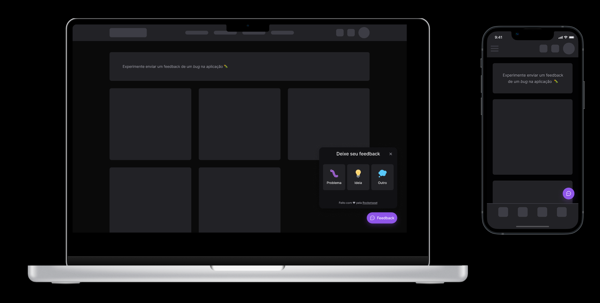

<h1 align="center">
    
</h1>

## 💻 About

This project is a Widget that can be used in mobile and web applications for sending a comment to the platform, including the possibility to take a photo of your screen, detailing the problem or suggestion.

## 🛠️ Functionalities

- Send comment
- Take screenshot
- Email sending

## 💻 Technologies for Web

- [React.js](https://reactjs.org/)
- [Vite](https://vitejs.dev/)
- [TypeScript](https://www.typescriptlang.org/)
- [Tailwindcss](https://tailwindcss.com/)
- [Jest](https://jestjs.io/)
- [Axios](https://axios-http.com/)

## 📱 Technologies for Mobile

- [React Native](https://reactnative.dev/)
- [React Native Gesture Handler](https://docs.swmansion.com/react-native-gesture-handler/)
- [Expo](https://expo.dev/)
- [Axios](https://axios-http.com/)

## 🚀 Technologies for Back-end

- [PostgreSQL](https://www.postgresql.org/)
- [Prisma](https://www.prisma.io/)
- [Express](https://expressjs.com/)
- [Nodemailer](https://nodemailer.com/about/)
- [SWC](https://swc.rs/)

## 🎨 Layout

The Layout was developed by [Ilana Mallak](https://www.figma.com/@ilanamallak) and you can access it on [Figma](https://www.figma.com/).

- [Link to acess](https://www.figma.com/community/file/1102912516166573468)
